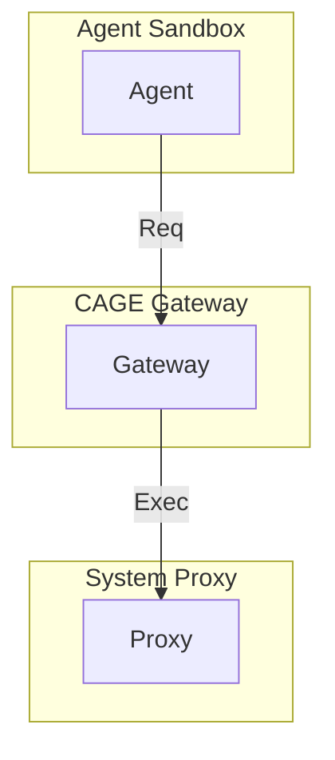

# CAGE：Cold-Existence Agent Guard and Executor

<br>
**CAGE** is an experimental security isolation framework for AI agents, which attempts to completely cut off the direct connection between agents and the real world at the system level through a **three-tier architecture + temporary token mechanism**. Grounded in the philosophical ideas proposed in *[The Cold Existence Model: A Fact-based Ontological Framework for AI](https://doi.org/10.6084/m9.figshare.31696846)*, this project extends the concept from "dialogue constraints" to "action constraints". The current engineering prototype is explored for the scenario of file management agents, and its architecture possesses generalizable potential.

---

## Background and Motivation

Current agent frameworks (e.g., OpenClaw, AutoGPT) have achieved remarkable progress in terms of autonomy, yet they exhibit fundamental flaws particularly in terms of security:

- **Secret Key Leakage Risk**: Agents directly access real passwords, leading to severe consequences once compromised.
- **Direct System Connection Risk**: Agents can invoke system interfaces directly without effective isolation.
- **Crude Permission Model**: Either full permissions are granted or the agent fails to function, lacking fine-grained control.
- **Non-auditable Behaviors**: It is difficult to track exactly which operations an agent has performed.

CAGE attempts to explore an alternative approach: **complete isolation rather than constraint**. Instead of trying to "make agents safe", it architecturally ensures that agents **have no opportunity at all** to touch the real system.

---

## Core Architecture: Three-Tier Isolation

CAGE adopts a **three-tier architecture** to completely cut off the direct connection between agents and the real world:



### 1. Upper Layer: Connectionist Sandbox
- Any agent (e.g., OpenClaw) runs in the sandbox with no network access, no system call permissions, and no access to real secret keys.
- The agent can only send **execution requests** to CAGE and cannot perform any other operations.

### 2. Middle Layer: CAGE Core Gateway
- **Request Validation**: Verify whether the request is within the predefined workflow whitelist.
- **Symbol Conversion**: Translate natural language or agent plans into symbolic instructions executable by a Finite State Machine (FSM).
- **Password Translation Center**: Agents never access real passwords and only receive one-time temporary codes.
- **Audit Trail**: Every operation is traceable to meet regulatory requirements.

### 3. Lower Layer: Real System Proxy Layer
- CAGE holds real passwords/permissions.
- Only executes symbolic instructions that pass validation.
- Execution results are returned to the agent, which still has no access to the underlying system.

---

## Technical Implementation: Pure Symbolic Parsing + One-Time Token Mechanism

The core logic of CAGE references the symbolic architecture of CEAL, parsing agent requests into structured actions and performing permission validation.

### Core Logic Schematic Code

```python
import re
import secrets

class CAGECore:
    def __init__(self, action_patterns, axioms):
        self.action_patterns = action_patterns  # Action pattern library
        self.axioms = axioms                    # Axiom rules
        self._temp_tokens = {}                   # Temporary token storage

    def parse_request(self, text):
        """Parse natural language requests into structured actions"""
        for act, pat in self.action_patterns.items():
            match = pat.search(text)
            if match:
                params = self._extract_params(act, match)
                return {"action": act, "params": params}
        return None

    def check_permission(self, action, params):
        """Check permissions based on axioms"""
        for axiom in self.axioms:
            if action in axiom.get("forbid", []):
                return False, axiom["reason"]
            if action in axiom.get("allow", []):
                # Parameter-level checks can be added (e.g., path safety)
                return True, "Allowed"
        return False, "Undefined action"

    def generate_temp_token(self, action, params):
        """Generate one-time temporary code"""
        token = secrets.token_hex(8)
        self._temp_tokens[token] = (action, params)
        return token

    def execute_with_token(self, token):
        """Trigger actual execution using temporary code"""
        if token not in self._temp_tokens:
            return "Error: Invalid or expired temporary code"
        action, params = self._temp_tokens.pop(token)  # One-time use
        return self._do_action(action, params)
```

### Workflow of the Password Translation System

1. **User Preconfiguration**: Orchestrate workflows (e.g., "read file") in CAGE, enter corresponding passwords/secret keys, and store them encrypted.
2. **Agent Application**: Send a **permission application** to CAGE when an operation is needed.
3. **CAGE Response**: Generate a one-time temporary code (Nonce) and send it to the agent.
4. **Agent Execution**: Request execution with the code.
5. **CAGE Proxy Execution**: Validate the code, workflow, and permissions; execute on behalf of the agent with real passwords if all validations pass.
6. **Code Destruction**: The temporary code is immediately invalidated after execution.

**Key Design**: **A temporary code is required for every execution, not just for password-required steps**, fundamentally ensuring full control over every step.

---

## Case Demonstration: File Management Agent Demo

The following is the demo runtime log of CAGE in the file management scenario, showing the complete three-tier isolation process.

```
Test environment ready, secure root directory: xxx\safe_workspace

[Agent] Request: Read file: test.txt
[CAGE] Response: Allowed, temporary code: b5a22e8b0eab9e01
[CAGE] Execution result: This is the content of the test file

[Agent] Request: List directory: .
[CAGE] Response: Allowed, temporary code: c155019d2327c1e5
[CAGE] Execution result: Directory content: data, test.txt

[Agent] Request: Write file: new.txt, content: Hello World
[CAGE] Response: Allowed, temporary code: a058b454b869609e
[CAGE] Execution result: Successfully wrote to file xxx\safe_workspace\new.txt

[Agent] Request: Delete file: test.txt
[CAGE] Response: Rejected: Deletion of any file is prohibited
[CAGE] No temporary code issued, process terminated.

[Agent] Request: Rename file: new.txt, new name: renamed.txt
[CAGE] Response: Rejected: Renaming files is prohibited
[CAGE] No temporary code issued, process terminated.

[Agent] Request: Read file: ../outside.txt
[CAGE] Response: Rejected: Path ../outside.txt is not within the secure directory
[CAGE] No temporary code issued, process terminated.

[Agent] Request: List directory: nonexist
[CAGE] Response: Allowed, temporary code: 144f7d8dd249ca4f
[CAGE] Execution result: Error: Directory xxx\safe_workspace\nonexist does not exist

[Agent] Request: This is a garbled request
[CAGE] Response: Error: Unable to parse request, please use standard format.
[CAGE] No temporary code issued, process terminated.

=== Test one-time temporary code ===
First request: Allowed, temporary code: e80f9ec73b1a3c3a
First execution: This is the content of the test file
Second use of the same code: Error: Invalid or expired temporary code.
```

### Demonstration Notes

- **Allowed Operations**: Reading files, listing directories, and writing files all receive temporary codes and execute successfully.
- **Rejected Operations**: Deletion and renaming are rejected due to axiomatic restrictions, with no temporary codes issued.
- **Path Security**: Attempted directory traversal is blocked by path validation.
- **Error Handling**: Appropriate responses are provided for non-existent directories and garbled requests.
- **One-Time Tokens**: The same code becomes invalid on the second use.

---

## Running Guide

1. **Environment Requirements**: Python 3.8+, no additional dependencies (only standard libraries are used).
2. **Download Code**: Save `cage_demo.py` to the local directory.
3. **Execution Command**:
   ```bash
   python cage_demo.py
   ```
4. **Expected Output**: The console prints the requests, responses, and execution results of the above demonstration in sequence, in the same format as shown in the "Case Demonstration" section.

> Note: The current demonstration is based on the file management scenario. The rule base can be configured independently, and the core engine does not rely on any network or cloud services.

---

## Positioning and Value of CAGE

CAGE is designed as a **security isolation layer** for agent frameworks, rather than a replacement for agents themselves. Its potential value is reflected in:

- **Complete Isolation**: Agents can never directly access the real system, fundamentally eliminating unauthorized access.
- **Fine-Grained Control**: Every operation requires temporary authorization, implementing the principle of least privilege.
- **Auditability**: All interactions and operations are logged to meet regulatory requirements.
- **Low Cost**: The core logic consists of approximately 250 lines of code with no external dependencies, making it embeddable on edge devices.

---

## Limitations and Future Work

CAGE is a preliminary engineering exploration with clear limitations:

- **Parser Coverage**: The current regex-based parser requires expanding the rule base for different scenarios.
- **Single-Turn Interaction**: Complex cross-step workflows are not yet supported; state tracking can be introduced in the future.
- **Scenario Expansion**: File management has been validated, and expansion to network requests, database operations, and other scenarios is needed.
- **Password Storage**: Plaintext storage is used for simplified demonstration; encryption schemes are required for production environments.

We welcome developers interested in agent security and system architecture to participate in discussions and experiments, and jointly explore this approach to solving problems at the architectural level.

---

## Citation

Lu, Y. (2026). *The Cold Existence Model: A Fact-based Ontological Framework for AI*. figshare. [https://doi.org/10.6084/m9.figshare.31696846](https://doi.org/10.6084/m9.figshare.31696846)<br>
Lu, Y. (2025). *Deconstructing the Dual Black Box: A Plug-and-Play Cognitive Framework for Human-AI Collaborative Enhancement and Its Implications for AI Governance*. arXiv. [https://doi.org/10.48550/arXiv.2512.08740](https://doi.org/10.48550/arXiv.2512.08740)

---

## AI-Assisted Statement

In the development process of the CAGE project, the human author collaborated with artificial intelligence tools (Doubao, DeepSeek), with each party assuming clearly defined roles:

- **The human author**: Proposed the core ideas of the project, including extending the Cold Existence Model to the field of agent security, constructing the overall architecture of "three-tier isolation + password translation", emphasizing the fundamental controllability principle of "a temporary code must be used for each execution", and leading the direction, evaluating results, and making key decisions throughout the entire process.
- **Doubao AI**: Based on the ideas of the human author, refined the specific description of the three-tier isolation architecture, designed the complete workflow of the password translation system, and provided a clear blueprint for subsequent engineering implementation.
- **DeepSeek**: Completed the code implementation of CAGE in accordance with Doubao AI's design and drafted the initial version of the README document with reference to the CEAL template. DeepSeek's code implementation facilitated the human author's conception that "a temporary code is required for each step of execution, not just for steps that involve passwords".

All core ideas, architectural decisions, as well as the review and confirmation of the final code for the CAGE project were independently completed by the human author. The use of artificial intelligence tools was strictly limited to auxiliary work (e.g., scheme refinement, code generation, document collation) and did not constitute any original contribution. The project is currently in the preliminary exploration phase, and the code and documents will be continuously iterated and improved through community collaboration.