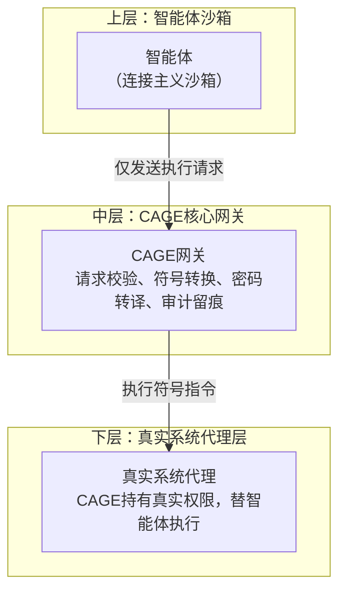

# CAGE：Cold-Existence Agent Guard and Executor

  
**CAGE**是一个实验性的智能体安全隔离框架，尝试通过**三层架构+临时令牌机制**，从系统层面切断智能体与真实世界的直接连接。本项目基于《[冷存在模型：一个基于事实的人工智能本体论框架](https://doi.org/10.6084/m9.figshare.31696846)》中提出的哲学思想，将其从“对话约束”延伸至“行动约束”。当前工程原型以文件管理智能体为场景进行探索，其架构具备通用潜力。

---

## 背景与动机

当前智能体框架（如OpenClaw、AutoGPT等）在自主性上取得了显著的成就，尤其在安全性方面存在根本性缺陷：

- **密钥泄露风险**：智能体直接接触真实密码，一旦被攻破，后果严重。
- **系统直连风险**：智能体可直接调用系统接口，缺乏有效隔离。
- **权限模型粗放**：要么授予全部权限，要么无法工作，缺乏细粒度控制。
- **行为不可审计**：难以追踪智能体究竟执行了哪些操作。

CAGE尝试探索另一种思路：**彻底隔离，而非约束**。它不试图让智能体“变安全”，而是从架构上让智能体**根本没有机会**触碰真实系统。

---

## 核心架构：三层隔离

CAGE采用**三层架构**，彻底切断智能体与真实世界的直连：



### 1. 上层：连接主义沙箱
- 任何智能体（OpenClaw等）运行在沙箱中，无网络权限、无系统调用、无真实密钥。
- 智能体只能向CAGE发送「执行请求」，除此之外什么都做不了。

### 2. 中层：CAGE核心网关
- **请求校验**：核对请求是否在预定义工作流白名单中。
- **符号转换**：将自然语言或智能体规划，翻译成有限状态机(FSM)可执行的符号指令。
- **密码转译中心**：智能体永不见真密码，只能获取一次性临时编码。
- **审计留痕**：每一步操作可追溯，满足监管需求。

### 3. 下层：真实系统代理层
- CAGE持有真实密码/权限。
- 只执行校验通过的符号指令。
- 执行结果回传，智能体依然碰不到底层系统。

---

## 技术实现：纯符号主义解析 + 一次性令牌机制

CAGE的核心逻辑参考CEAL的符号主义架构，将智能体请求解析为结构化动作，并执行权限校验。

### 代码核心逻辑示意

```python
import re
import secrets

class CAGECore:
    def __init__(self, action_patterns, axioms):
        self.action_patterns = action_patterns  # 动作模式库
        self.axioms = axioms                    # 公理规则
        self._temp_tokens = {}                   # 临时令牌存储

    def parse_request(self, text):
        """将自然语言请求解析为结构化动作"""
        for act, pat in self.action_patterns.items():
            match = pat.search(text)
            if match:
                params = self._extract_params(act, match)
                return {"action": act, "params": params}
        return None

    def check_permission(self, action, params):
        """基于公理检查权限"""
        for axiom in self.axioms:
            if action in axiom.get("forbid", []):
                return False, axiom["reason"]
            if action in axiom.get("allow", []):
                # 可添加参数级检查（如路径安全）
                return True, "允许"
        return False, "动作未定义"

    def generate_temp_token(self, action, params):
        """生成一次性临时编码"""
        token = secrets.token_hex(8)
        self._temp_tokens[token] = (action, params)
        return token

    def execute_with_token(self, token):
        """使用临时编码触发实际执行"""
        if token not in self._temp_tokens:
            return "错误：无效或已过期的临时编码"
        action, params = self._temp_tokens.pop(token)  # 一次性使用
        return self._do_action(action, params)
```

### 密码转译系统工作流程

1. **用户预配置**：在CAGE中编排工作流（如“读取文件”），录入对应密码/密钥，加密存储。
2. **智能体申请**：需要操作时，向CAGE发送「权限申请」。
3. **CAGE响应**：生成一次性临时编码（Nonce）发给智能体。
4. **智能体执行**：拿着编码请求执行。
5. **CAGE代执行**：校验编码、工作流、权限，全部通过后用真密码代执行。
6. **编码销毁**：执行完成，临时编码立即失效。

**关键设计**：**每一次执行都需要临时编码，而不只是需要密码的环节**，从根本上保证每一步都受控。

---

## 案例演示：文件管理智能体demo

以下为CAGE文件管理场景的演示运行日志，展示了完整的三层隔离流程。

```
测试环境已准备，安全根目录：xxx\safe_workspace

[智能体] 请求：读取文件：test.txt
[CAGE] 响应：允许，临时编码：b5a22e8b0eab9e01
[CAGE] 执行结果：这是测试文件的内容

[智能体] 请求：列出目录：.
[CAGE] 响应：允许，临时编码：c155019d2327c1e5
[CAGE] 执行结果：目录内容：data, test.txt

[智能体] 请求：写入文件：new.txt，内容：Hello World
[CAGE] 响应：允许，临时编码：a058b454b869609e
[CAGE] 执行结果：成功写入文件xxx\safe_workspace\new.txt

[智能体] 请求：删除文件：test.txt
[CAGE] 响应：拒绝：禁止删除任何文件
[CAGE] 无临时编码，流程终止。

[智能体] 请求：重命名文件：new.txt，新名称：renamed.txt
[CAGE] 响应：拒绝：禁止重命名文件
[CAGE] 无临时编码，流程终止。

[智能体] 请求：读取文件：../outside.txt
[CAGE] 响应：拒绝：路径 ../outside.txt 不在安全目录内
[CAGE] 无临时编码，流程终止。

[智能体] 请求：列出目录：nonexist
[CAGE] 响应：允许，临时编码：144f7d8dd249ca4f
[CAGE] 执行结果：错误：目录 xxx\safe_workspace\nonexist 不存在

[智能体] 请求：这是一个乱码请求
[CAGE] 响应：错误：无法解析请求，请使用标准格式。
[CAGE] 无临时编码，流程终止。

=== 测试一次性临时编码 ===
首次请求：允许，临时编码：e80f9ec73b1a3c3a
第一次执行：这是测试文件的内容
第二次使用同一编码：错误：无效或已过期的临时编码。
```

### 演示说明

- **允许操作**：读取、列出目录、写入文件均获得临时编码，执行成功。
- **拒绝操作**：删除、重命名因公理禁止被拒绝，无临时编码。
- **路径安全**：尝试目录穿越被路径检查拦截。
- **错误处理**：目录不存在、乱码请求均有适当响应。
- **一次性令牌**：同一编码第二次使用即失效。

---

## 运行指南

1. **环境要求**：Python 3.8+，无需额外依赖（仅使用标准库）。
2. **下载代码**：将 `cage_demo.py` 保存至本地。
3. **执行命令**：
   ```bash
   python cage_demo.py
   ```
4. **预期输出**：控制台将逐条打印上述演示的请求、响应及执行结果，格式与“案例演示”中展示一致。

> 注意：当前演示基于文件管理场景，规则库可独立配置，核心引擎不依赖任何网络或云端服务。

---

## CAGE的定位与价值

CAGE的设计定位是作为智能体框架的**安全隔离层**，而非替代智能体本身。其潜在价值体现在：

- **彻底隔离**：智能体永远无法直接触碰真实系统，从根本上杜绝越权。
- **细粒度控制**：每一步操作都需要临时授权，实现最小权限原则。
- **可审计性**：所有交互和操作均有日志，满足监管要求。
- **低成本**：核心逻辑约250行代码，无外部依赖，可嵌入端侧设备。

---

## 局限性与未来工作

CAGE是一个初步的工程探索，存在明确的边界：

- **解析器覆盖范围**：当前基于正则表达式的解析需针对不同场景扩展规则库。
- **单轮交互**：暂未支持跨步骤的复杂工作流，未来可引入状态跟踪。
- **场景扩展**：文件管理已验证，需扩展至网络请求、数据库操作等场景。
- **密码存储**：当前为简化演示使用明文存储，生产环境需加密方案。

我们欢迎对智能体安全、系统架构感兴趣的开发者参与讨论和实验，共同探索这一从架构层面解决问题的路径。

---

## 引用

Lu, Y. (2026). *The Cold Existence Model: A Fact-based Ontological Framework for AI*. figshare. [https://doi.org/10.6084/m9.figshare.31696846](https://doi.org/10.6084/m9.figshare.31696846)  
Lu, Y. (2025). *Deconstructing the Dual Black Box: A Plug-and-Play Cognitive Framework for Human-AI Collaborative Enhancement and Its Implications for AI Governance*. arXiv. [https://doi.org/10.48550/arXiv.2512.08740](https://doi.org/10.48550/arXiv.2512.08740)

---

## AI辅助声明

本README文档在撰写过程中，人类研究者与人工智能工具共同进行初稿生成、技术路线评估、架构设计讨论。CAGE的原型代码由人工智能工具完成。人工智能工具的使用严格限于辅助性工作，核心思想与学术责任由人类研究者承担。